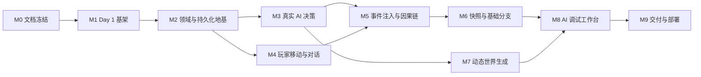

# AI 蝴蝶小镇实现规划

> 规划状态：Draft for review  
> 需求基线：**Living Requirement Map v1.3（D01–D124）**  
> 执行原则：核心纵向切片优先，内置世界与动态生成双轨交付  
> 当前节点：M3 已完成；按最新决定优先推进视觉生成管线

## 1. 规划目标

本规划把需求映射为可提交、可演示、可测试的里程碑。优先级定义：

- **P0**：面试主流程不可缺少，失败则不能交付；
- **P1**：形成明显亮点，时间不足时允许缩小深度但不能伪装已完成；
- **Reserved**：保留 Schema/接口，不在 3 天 MVP 内完整实现。

每个里程碑必须满足：代码可运行、离线测试通过、README/技术文档同步、提交信息可解释。禁止跨多个核心能力堆积未验证的大提交。

## 2. 需求到里程碑映射

| v1.3 区段 | 核心内容 | 交付里程碑 |
| --- | --- | --- |
| D01–D12 | 连续世界、三层玩家、周期/事件决策 | M1、M3、M4 |
| D13–D24 | NPC 身份/状态/计划/记忆/关系/动作 | M2、M3、M4 |
| D25–D36 | 玩家移动、对话、事件注入、因果、分支 | M4、M5、M6 |
| D37–D48 | 动态世界、Blueprint、美术、视觉审查、扩展 | M7；运行时扩展 Reserved |
| D49–D60 | 时钟、跳过、数值、关系、经济、原子动作 | M2、M4；价格/配方 Reserved |
| D61–D72 | 四类 AI、结构化输出、降级、调试 | M3、M7、M8 |
| D73–D90 | 页面、存储、Mock、测试与全栈技术架构 | M2–M9 |
| D91–D100 | 面试范围与双轨交付 | 全里程碑的裁剪边界 |
| D101–D111 | README、Docker、部署、视频、交付检查 | M9 |
| D112–D124 | 栖溪镇及暴雨事件演示场景 | M1、M5 |

## 3. 里程碑总览



## 4. M0：需求与技术方案冻结（当前）

**目标**：在继续编码前统一“做什么、为什么、做到什么算完成”。

### 任务

- [x] 以 Living Requirement Map v1.3 D01–D124 为唯一产品需求基线；
- [x] 审计 Day 1 代码、提交、测试和真实完成度；
- [x] 编写架构、数据、API、AI、Mock、测试、部署方案；
- [x] 编写里程碑、验收矩阵、风险和裁剪顺序；
- [x] 用户确认技术方案与实现顺序。

### Gate

文档明确区分已实现、计划实现和 Reserved；用户确认后才能进入 M2。后续需求变化记入决策账本，不静默扩大范围。

## 5. M1：Day 1 可玩基架（已完成）

**对应提交**：`3127c01 feat: complete day-one playable town slice`

### 已交付能力

- 简单账号密码登录；
- 世界库与内置栖溪镇；
- 5 名完整 NPC 档案和动态状态；
- Phaser 地图、点击 NPC 与信息抽屉；
- 可解释、可复现的 Mock 自主决策；
- 2 秒现实时间 = 1 小镇分钟的连续运行；
- 暂停/继续、WebSocket 实时投影；
- SQLite/WAL 保存恢复；
- 单元/API 集成测试与生产构建。

### 已验证证据

- `pnpm verify` 通过；
- 浏览器走通登录、进入世界、NPC 更新、抽屉、暂停/继续与刷新恢复；
- 无任何 AI Key 时主流程完整可体验。

### 已知技术债

- 直接坐标切换需要升级为路径命令与插值移动；
- Schema 只覆盖最小状态，需要兼容迁移；
- WebSocket 只有快照/Tick，没有统一信封、断线补发和版本冲突恢复；
- Vite 主包因 Phaser 约 1.56 MB，交付前通过路由懒加载和 Phaser 动态导入优化。

## 6. M2：领域模型与持久化地基（Day 2，P0，已完成）

**目的**：先建立后续 AI、玩家与因果链共同依赖的安全边界，避免每个功能各写一套状态修改逻辑。

**完成证据**：旧库增量迁移、默认分支/初始快照、共享命令契约、版本化事务、命令幂等、事务回滚、WebSocket 统一信封与恢复已经落地；自动化测试和真实浏览器回归通过。

### 任务顺序

1. 扩展共享 Schema：`ActionDefinition/ActionIntent/WorldMessage/AppError`；
2. 添加 `branches/snapshots/relationships/memories/knowledge/ai_traces` 最小表；
3. 为现有 demo world 创建默认 branch 和初始 snapshot；
4. 抽取 `WorldRepository/EventRepository/AgentRepository` 接口；
5. 实现统一命令事务：版本校验 → 前置校验 → 状态更新 → Event → version；
6. WebSocket 升级到统一信封，支持 `afterVersion` 补发，超窗回快照；
7. 将时钟推进与 NPC 决策从固定 Timer 逻辑拆成可单测的世界周期。

### 验收

- 旧数据库能自动或通过一次性迁移继续启动；
- 相同 `expectedVersion` 的重复命令不会提交两次；
- 事务中任一步失败时状态和事件都不改变；
- WebSocket 消息版本单调，模拟断线后能补齐或收到快照；
- Day 1 主流程无回归。

### 主要代码落点

`packages/shared/src`、`apps/server/src/db`、`apps/server/src/modules/world`、`apps/server/src/modules/timeline`、`apps/server/src/realtime`。

## 7. M3：真实 AI 决策与可解释降级（Day 2，P0，已完成）

**目的**：证明 NPC 不是固定脚本，并让真实 AI 进入受控的状态执行链。

**完成证据**：Responses/Chat Provider、候选限制、结构化校验与修复、两次尝试、无 Key/超时/坏输出/调用预算降级、事务化 Trace、NPC 决策面板已经落地；17 个自动化测试与三轮 Ego Lite 场景回归通过。

### 任务顺序

1. 定义 `AIProvider` 与四角色配置，本里程碑先实现 `SIMULATION` 文本接口；
2. 规则引擎生成 3–6 个合法候选动作；
3. 构建最小决策上下文：人格、状态、计划、Top-K 记忆、可知事件、候选；
4. 实现 Structured Output / Tool Call / JSON fallback 解析；
5. 实现 Zod + 引用 + 世界版本校验，最多一次修复；
6. 设置超时、一次重试和世界级并发上限；
7. 失败、无 Key、超额时自动使用当前可复现 Mock；
8. 保存 AI Trace 和前后状态差异；
9. NPC 抽屉新增“决策”页，普通用户看简明原因，开发模式看完整 Trace。

### 验收场景

- 配置 Key 时，至少一名 NPC 的候选选择来自真实模型；
- 删除 Key 后无需重启前端即可明确进入 Mock，世界仍继续；
- 模型返回不存在的地点/动作时不会写入数据库；
- 模拟超时和坏 JSON 后只降级一次，不出现重复动作；
- 两名人格不同 NPC 面对同一候选集产生可辨识差异；
- Trace 能回答“给了什么上下文、为什么选、是否降级、改了什么状态”。

### 不在本里程碑做

WORLD/IMAGE/VISION 的真实业务流程留到 M7；不引入通用 Agent 编排框架。

## 8. M4：玩家居民、A* 移动与对话（Day 2，P0）

**目的**：把玩家从观察者升级为世界中的可交互居民 Agent。

### 任务顺序

1. 在 World State 增加玩家实体，默认档案与当前位置持久化；
2. Blueprint 落地网格、障碍、入口和地点能力；
3. 实现共享 A* 服务：服务端校验路径，客户端插值呈现；
4. 地图点击移动；远程查看不移动，现场动作自动接近；
5. 实现对话会话、参与者锁和紧急中断；
6. 接入 SIMULATION 角色的对话 Schema；
7. 实现 Mock 对话的意图/提及/人格/心情/关系模板；
8. 每次对话写事件，提取近期记忆并小幅更新有向关系；
9. 对话抽屉提供自由输入与至少 3 个上下文动作。

### 验收场景

- 玩家不能穿过建筑/河流，非法坐标被服务端拒绝；
- 点击远处 NPC 的“交谈”会先靠近，到达交互距离后打开会话；
- 对话时其他 NPC 和世界时钟继续运行；
- 紧急事件可中断会话并释放锁；
- 林夏与沈知衡对相同提问的语气、关注点明显不同；
- 刷新后玩家位置、对话事件与关系变化仍存在。

### Reserved

复合自然语言行动只保留 `CompositeActionPlan` Schema，不在 MVP 内执行开放式长链任务。

## 9. M5：事件注入与因果链（Day 2，P0/P1）

**目的**：完成项目最有辨识度的“玩家影响世界”闭环。

### 任务顺序

1. 观察者工具栏加入事件模板与自由文本入口；
2. WORLD 模型或 Mock 将文本转换为结构化事件预览；
3. 玩家确认后以世界命令提交客观事实；
4. 计算可见/可听/公共信息传播范围，生成 NPC Knowledge；
5. 对受影响 NPC 触发重新规划，使用受控并发；
6. 由执行结果生成 `causeIds`，必要时补充规则推断边；
7. 建设基础时间线/因果页：列表 + 2 级链路图 + 类型/NPC 过滤；
8. 预置 08:40 暴雨事件模板，但不预置 NPC 反应。

### 验收场景

- 自由文本必须先看到结构化预览，取消不会改变世界；
- 注入暴雨后至少 2 名 NPC 因不同状态/人格改变计划；
- 因果页显示“暴雨事实 → 知识/计划改变 → 行动”；
- 不知情 NPC 的对话不能引用该事件；
- 同一事件重复提交受幂等键保护；
- Mock 模式下固定 Seed 可重现相同传播和响应。

### 裁剪规则

P0 是两级时间线/因果链和可见性；复杂图布局、置信度编辑和跨分支对照属于 P1。

## 10. M6：快照、跳过与基础分支（Day 2 末，P1）

**目的**：让长时间世界可恢复，并实现需求中的“回到历史但不覆盖原世界”。

### 任务

- 周期快照和重大事件快照；
- 跳过当前动作/下一个重要事件，后台按完整周期推进；
- 紧急事件自动停止跳过并展示摘要；
- 从历史事件恢复时创建子分支；
- 世界库显示当前分支和最近里程碑；
- 最小世界包导出，导入为新副本。

### 验收

- 快照 + 后续事件恢复出的 checksum 与当前投影一致；
- 从旧节点继续后原分支事件数量和内容不变；
- 跳过期间 NPC 状态、记忆、经济与事件都按正常规则更新；
- 恢复/导入失败不破坏已有世界。

若 Day 2 时间紧，只做初始/手动快照和一次基础分支；滚动清理与完整导出放到 Day 3。

## 11. M7：一句话动态生成与美术降级（Day 3，P0/P1）

**目的**：双轨交付：内置世界保证演示，动态世界生成体现扩展能力。

### P0 任务

1. 创建世界页面：一句话输入、高级人口/风格设置；
2. SQLite `jobs/job_attempts/assets` 与 Worker 租约机制；
3. WORLD Provider 输出结构、NPC、规则与 Blueprint；
4. 结构验证、引用修复、人口默认 5/可覆盖；
5. 程序化生成地图、室内和角色占位资产；
6. 分阶段进度、失败重试和从阶段恢复；
7. 无 Key 时使用模板/Seed 生成一个不同于内置镇的可玩世界。

### P1 任务

- IMAGE Provider 真实接口、缓存和资产哈希；
- VISION Provider 审查视觉与 Blueprint 一致性；
- 审查失败重试一次，再回退程序化资产；
- 风格规范在世界创建后锁定；
- 路径自动测试所有入口和关键地点。

### 验收

- 输入一句话能生成可进入、可运行、有 5 名 NPC 的世界；
- 生成中重启服务后能从最后完成阶段继续；
- 图片接口慢/失败不会阻塞结构世界进入可玩状态；
- 图片不能改变碰撞、入口和路径几何；
- Job 状态、错误和降级原因对用户可见。

### Reserved

玩家/NPC 运行时提出扩建方案只实现接口与预览数据结构；自由地块和相邻 Chunk 的完整扩建不进入 MVP。

## 12. M8：AI 调试工作台（Day 3，P1 亮点）

**目的**：让面试官直接看到 AI 是如何被约束、校验和降级的。

### 任务

- Trace 列表按世界、NPC、角色、结果、降级状态过滤；
- 详情显示模型、最小上下文、候选、输出、校验、延迟、Token/成本和状态差异；
- 沙盒编辑 Prompt/上下文并重放；
- 真实模型 vs 另一个模型/Mock 对比；
- 重放默认不写回，明确展示 Sandbox 标记；
- 敏感字段脱敏，前端永远拿不到 API Key。

### 验收

- 从 NPC 抽屉可跳转到对应 Decision Trace；
- 能现场构造非法输出并展示校验/降级；
- 同一上下文可对比 AI 与 Mock，不改变正式世界版本；
- 无 Key 时工作台仍能查看 Mock Trace。

## 13. M9：测试、交付与面试准备（Day 3，P0）

### 工程交付

- 增加 lint、确定性多周期仿真、WebSocket、故障注入和一条 Playwright E2E；
- 增加 `test:ai`，四角色契约测试手动触发；
- GitHub Actions 执行 lint、typecheck、offline tests、build；
- Fastify Route Schema 自动生成 OpenAPI；
- Dockerfile/Compose 一键启动并挂载数据库与资产；
- 生产环境单服务托管 Web/REST/WS/Worker；
- 完成 `.env.example`、部署说明、演示账号/限额/有效期；
- 路由懒加载，处理 Phaser 大包告警。

### 文档与展示

- README 5 分钟 Quick Start、架构摘要、AI/Mock、常见错误；
- 技术方案同步最终实现状态；
- 记录关键决策账本和 AI 修改案例：AI 生成的物品转移代码存在事务/幂等问题，人工修正并补测试；
- 录制约 5 分钟视频；
- 准备现场修改题：新增一个 Action Tool，从 Schema、候选、执行器到 UI/测试全链路；
- 运行一键交付检查并保存结果。

### 五分钟演示脚本

| 时间 | 内容 | 证明点 |
| --- | --- | --- |
| 0:00–0:35 | 登录、世界库、进入栖溪镇 | 可启动、可恢复 |
| 0:35–1:20 | 观察 5 NPC，打开两个决策 | 自主性、人格差异、可解释 |
| 1:20–2:05 | 玩家移动并和 NPC 对话 | 空间交互、AI 对话、世界不停 |
| 2:05–3:10 | 注入暴雨，观察计划/行动变化 | 蝴蝶效应与感知边界 |
| 3:10–3:45 | 打开因果链与分支/快照 | 可追踪、可恢复 |
| 3:45–4:25 | AI 工作台展示结构化输出与 Trace | AI 真接入且受控 |
| 4:25–4:45 | 关闭 Key/模拟超时 | 降级仍可玩 |
| 4:45–5:00 | 一句话生成页面与验证结果 | 双轨扩展能力 |

## 14. Day 2 建议执行顺序

为减少并行改动冲突，按下面顺序推进；时间块是优先顺序，不是承诺工时：

| 顺序 | 工作块 | 退出条件 |
| --- | --- | --- |
| 1 | 共享 Schema、迁移、Branch/Event 基座 | Day 1 回归 + 事务/版本测试通过 |
| 2 | Action Registry 与 A* | NPC/玩家共享合法移动命令 |
| 3 | AIProvider、决策输出、Trace、降级 | 真 AI 与坏输出测试各通过一次 |
| 4 | 玩家实体、靠近交互、对话 | Mock/AI 两种对话均可走通 |
| 5 | 事件预览、传播、触发重规划 | 暴雨场景产生差异行动 |
| 6 | 因果页、快照/基础分支 | 至少两级链路且刷新恢复 |
| 7 | 全量回归与里程碑提交 | `pnpm verify` + 手工主流程 |

## 15. 测试与验收矩阵

| 主流程 | 正常路径 | 降级/故障路径 | 自动化 |
| --- | --- | --- | --- |
| 登录 | demo 登录并恢复世界 | 错误密码、过期 Cookie | API 集成 |
| 自主决策 | AI 选择合法动作 | 无 Key、超时、坏 JSON、过期版本 | 单元 + 集成 |
| 移动 | A* 到达交互距离 | 不可达、版本冲突、目标移动 | 单元 + E2E |
| 对话 | 人格化回复并写记忆 | Mock、紧急中断、未知事实澄清 | 集成 + E2E |
| 事件注入 | 预览确认后传播 | 取消、重复提交、不可见 NPC | 集成 + E2E |
| 因果链 | 两级以上可追踪 | 缺失父事件不允许提交 | 单元 + API |
| 快照分支 | 恢复生成新分支 | 坏校验和、导入冲突 | 集成 |
| 世界生成 | 结构/美术/路径完成 | Worker 重启、图片失败、程序化降级 | 集成 |
| AI Lab | Trace/重放/对比 | 脱敏、无 Key、禁止写回 | API + E2E |

## 16. 风险与应对

| 风险 | 概率/影响 | 早期信号 | 应对 |
| --- | --- | --- | --- |
| 需求过宽导致主流程不完整 | 高/高 | Day 2 中段仍在改底层 | 严格按 Gate；先内置镇闭环，再生成 |
| AI 输出不稳定 | 高/高 | Schema 修复频繁 | 候选受限、一次修复、立即 Mock |
| 20 NPC 调用成本/延迟过高 | 中/高 | Tick 堆积 | 事件共享解释、受控并发、按需调用、缓存 |
| 事件/状态双写不一致 | 中/高 | 刷新后状态漂移 | 单事务、版本唯一、快照 checksum |
| 路径与 AI 图片不一致 | 中/高 | 角色穿墙或入口错位 | Blueprint 权威、图像只表现、自动路径测试 |
| 生成任务中断 | 中/中 | 页面永久 Loading | 持久化阶段、租约、幂等恢复、程序化降级 |
| Phaser 包过大/首屏慢 | 高/中 | Build 警告、冷加载慢 | 路由懒加载、动态 import、Loading 进度 |
| 线上服务冷启动或配额耗尽 | 中/高 | 演示首屏超时 | 健康预热、限额、缓存、本地/视频备份 |

## 17. 时间不足时的裁剪顺序

只裁深度，不切断主流程。按以下顺序从后往前缩减：

1. 运行时地图扩建完整实现（原本即 Reserved）；
2. 价格策略、生产配方、严重后果规则（保留字段）；
3. 视觉模型自动审查（保留 Adapter，手动或路径审查）；
4. 世界包中的资产内嵌与高级垃圾回收；
5. 因果图高级布局和跨分支对照；
6. AI 工作台双真实模型对比，保留 AI vs Mock；
7. 非核心建筑丰富室内，保留可进入模板。

不可裁掉：真实 AI 至少一次、完整 Mock、玩家对话、NPC 自主决策、事件注入与两级因果链、保存恢复、错误降级、自动化测试、README。

## 18. 提交规划

每个提交保持可运行：

```text
docs: add v1.3 technical design and implementation plan
feat: add versioned world command and timeline foundation
feat: add validated ai decisions with mock fallback
feat: add player pathfinding and contextual dialogue
feat: add event injection and causal timeline
feat: add snapshots and basic timeline branching
feat: add recoverable world generation pipeline
feat: add ai inspection and sandbox replay
test: add offline e2e and failure injection coverage
chore: add ci docker openapi and delivery checks
docs: finalize demo guide and decision ledger
```

不为追求提交数量拆无意义 commit，也不把多天能力压成一个无法审查的大提交。

## 19. 一键交付检查

最终提供 `pnpm delivery:check`，至少执行：

1. 环境变量与默认密钥检查；
2. lint、typecheck、离线测试、E2E、生产构建；
3. 空数据库启动、Seed、登录和健康检查；
4. Mock 主流程烟测；
5. OpenAPI 生成与工作树检查；
6. Docker 构建；
7. 输出人工检查清单：线上 URL、演示账号、AI 限额、视频、有效期。

真实 AI 合约测试必须显式传入 `RUN_AI_TESTS=1`，不会被默认 CI 或交付检查意外调用。

## 20. Definition of Done

只有同时满足以下条件，项目才算完成：

- 六个核心路由可访问，主界面抽屉交互完整；
- 内置栖溪镇主流程、动态生成主流程和无 Key Mock 主流程均能走通；
- 5 名 NPC 差异可观察，数据结构与并发策略支持约 20 名；
- 玩家能移动、对话、注入事件并看到两级因果后果；
- AI 输出经过 Schema/引用/版本校验，失败可解释降级；
- 刷新、重启与基础分支不会破坏世界状态；
- `pnpm delivery:check` 通过；
- README、技术方案、OpenAPI、`.env.example`、Docker、线上地址和视频齐全；
- 文档中的“已实现”与实际代码一致，不用规划能力冒充成品。

---

M3 已完成。根据最新产品决定，下一步先审计 WorldX 的世界设计、地图、识图与角色精灵编排，提炼为我们自己的 **Blueprint 权威 + IMAGE 生成 + VISION 审查 + 程序化降级** 管线；不复制其实现，并继续保持栖溪镇的独立产品结构。
