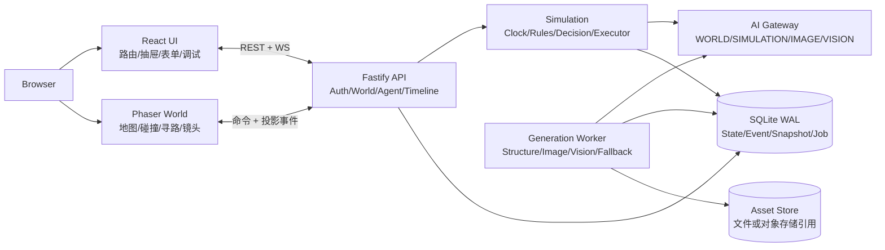
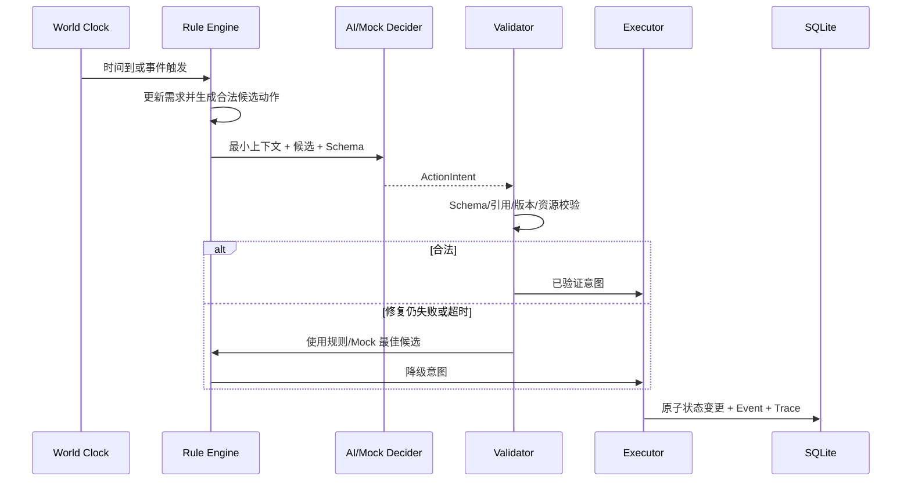

# AI 蝴蝶小镇技术方案

> 文档状态：Draft for review  
> 需求基线：**Living Requirement Map v1.3（D01–D124）**  
> 当前实现基线：Day 1 里程碑，提交 `3127c01`  
> 适用范围：腾讯 AI 引擎部 AI 全栈工程师面试项目

## 1. 文档目的与范围

本项目要在 2–3 天的面试作业周期内，交付一个可以真实体验、可以解释、可以现场修改的 Web AI 小镇 MVP。重点不是复刻大型生成式世界，而是证明以下能力：

1. 把开放需求拆成可验证的产品与工程边界；
2. 让 NPC 基于状态、记忆、人格和环境自主决策，而不是播放固定脚本；
3. 把真实 AI 放在结构化、可验证、可降级的执行链中；
4. 让玩家的对话和事件注入能够进入世界状态并产生可观察的后果；
5. 做到无密钥仍可体验、失败可恢复、状态可保存、核心链路有测试。

### 1.1 MVP 成功标准

- README 的本地启动流程可一次跑通；
- 内置“栖溪镇”至少 5 名完整 NPC 能持续自主运行，并可扩展到约 20 人；
- 玩家能观察、查看 NPC、移动、对话并注入事件；
- 决策链能展示“候选动作 → AI/Mock 选择 → 校验 → 原子执行 → 状态变化”；
- 至少一次真实 AI 决策或对话可现场演示；未配置密钥时主流程完整可玩；
- 世界刷新后恢复，具备事件日志、快照与基础分支能力；
- 可展示至少两级因果链；
- `pnpm verify` 覆盖类型检查、离线测试和生产构建。

### 1.2 明确不做

- 不做注册、找回密码、OAuth、复杂权限体系；
- 不做 MMORPG 级同步、多人协同编辑或分布式仿真；
- 不让模型生成并执行任意代码；
- 不在 MVP 内实现完整生产制造、动态市场定价和 NavMesh；
- 不做完整 LLMOps 平台，AI 工作台只服务本项目的解释、对比与调试；
- 不把 90/10 反脸谱化或戏剧性评分作为正式验收要求。

## 2. 核心架构决策

| 决策 | 选择 | 原因 | 代价 |
| --- | --- | --- | --- |
| 前后端 | 全栈 TypeScript Monorepo | 共享 Schema，降低 3 天项目的上下文切换 | Node 单进程不适合超大规模仿真 |
| 世界权威 | Fastify 服务端唯一权威 | 防止客户端与 AI 直接篡改状态，便于保存与回放 | 所有动作都需走命令接口 |
| 地图/UI | Phaser 管空间，React 管产品 UI | 地图交互与抽屉、表单、调试页各用擅长工具 | 需要明确事件桥接边界 |
| 决策模式 | 规则筛选 + AI/Mock 选择 + 确定性执行器 | AI 真正参与，同时确保合法、可测试、可降级 | 需要维护 Action Schema 和校验器 |
| 数据 | SQLite + WAL + Drizzle + Repository | 本地/单机部署简单，事务足够强 | 横向扩容时需替换存储实现 |
| 实时 | REST 命令/查询 + WebSocket 事件 | 命令清晰、实时观察自然 | 要处理断线和版本缺口 |
| 持久化 | 追加事件日志 + 周期快照 | 兼顾审计、因果解释和快速恢复 | 比只存最终状态多一层复杂度 |
| AI 接入 | 四角色轻量 Provider + 结构化输出 | 可按任务换模型/兼容 OpenAI 协议 | 不追求通用 Agent 框架能力 |
| 降级 | Mock 是一等运行模式 | 无 Key、超时、限额时仍能完成演示 | Mock 行为深度低于真实模型 |
| 后台任务 | SQLite 持久化 JobQueue | 生成流程可恢复，部署仍是单机 | 高吞吐时需迁移外部队列 |

## 3. 总体架构



### 3.1 架构原则

1. **服务端权威**：客户端提交意图，不提交最终坐标、关系值或资源余额。
2. **AI 不是数据库写入者**：模型只返回结构化建议，执行器验证并在事务中提交。
3. **一套事实，多种视图**：客观世界状态、NPC 已知事实、NPC 主观解释分层保存。
4. **每次提交可追踪**：状态变化拥有 `event_id`、`world_version`、原因和来源。
5. **故障不阻断世界**：AI 失败降级到规则/Mock；生成失败降级到缓存或程序化资产。
6. **先纵向贯通再加深**：面试主流程优先于功能数量。

## 4. 代码组织

### 4.1 当前结构

```text
apps/web                 React + Phaser 客户端
apps/server              Fastify + SQLite 服务端
packages/shared          前后端共享 Zod Schema 与类型
```

### 4.2 目标结构

```text
apps/server/src/
  modules/auth           登录与 Cookie 身份
  modules/world          世界查询、命令、时钟与分支
  modules/agent          人设、状态、记忆、关系、计划
  modules/simulation     候选生成、决策、动作执行
  modules/dialogue       对话会话、可见上下文、记忆写入
  modules/timeline       事件、因果边、快照与回放
  modules/generation     世界生成阶段与 Job Worker
  modules/ai             四角色 Provider、Trace、降级
  modules/asset          资产引用、哈希与清理
  db                     Schema、迁移、Repository
apps/web/src/
  game                   Phaser 场景、寻路、投影同步
  features               world/npc/dialogue/event/timeline/ai-lab
  pages                  六个核心路由
  services               REST、WebSocket、错误归一化
  state                  Zustand 客户端瞬时状态
packages/shared/src/
  schemas                API、事件、动作、AI 输出 Schema
  contracts              错误码、WebSocket 信封、常量
```

迁移采用“碰到即抽取”的方式；不为了目录美观一次性重写 Day 1 代码。

## 5. 领域模型

### 5.1 世界与时间线

| 实体 | 关键字段 | 不变量 |
| --- | --- | --- |
| `World` | id, ownerId, name, prompt, clock, version, activeBranchId, paused, rules | 每个已提交命令使版本单调递增 |
| `Branch` | id, worldId, parentBranchId, forkEventId, headVersion | 从历史恢复必须创建新分支，不覆盖原时间线 |
| `WorldEvent` | id, branchId, version, gameMinute, type, actorId, payload, causeIds | 同一分支的 version 唯一且有序 |
| `CausalEdge` | fromEventId, toEventId, relation, confidence | 只引用同一世界已有事件 |
| `Snapshot` | branchId, version, stateBlob, reason, checksum | 可由快照 + 后续事件恢复到目标版本 |

### 5.2 NPC

| 层 | 内容 |
| --- | --- |
| 稳定档案 | 姓名、年龄、身份、自然语言简介、性格数值、偏好/厌恶、价值观、长期目标 |
| 动态状态 | 位置、动作、健康、饥饿、精力、心情、压力、社交、金钱、库存、世界特定状态 |
| 认知 | 已知事实、来源、置信度、主观解释 |
| 计划 | 长期目标、当日计划、当前动作、可中断性 |
| 记忆 | 近期事件、重要度、长期摘要、反思 |
| 关系 | 有向的熟悉度、喜欢、信任、尊重、标签、共同经历、自然语言印象 |

内部状态统一为 0–100 数值；普通 UI 只展示“偏低/正常/偏高/严重”等级，AI 调试页可查看精确数值。

### 5.3 地图与地点

- `WorldBlueprint` 是几何与玩法的唯一权威，包含网格、障碍、建筑、入口、室内层、对象与出生点；
- AI 图片只提供视觉表现，不能改变 Blueprint 几何；
- 地点声明能力标签：`eat/rest/work/social/safety/health/public_info`；
- 主建筑都可进入，咖啡馆与诊所作为两处丰富室内，其余采用程序化模板；
- 首期使用网格 A*，NavMesh 只保留适配接口。

### 5.4 动作模型

```ts
type ActionIntent = {
  actionId: string;
  actorId: string;
  targetIds?: string[];
  locationId?: string;
  parameters: Record<string, unknown>;
  reason: string;
  expectedWorldVersion: number;
};
```

动作定义包含前置条件、资源预留、持续时间、可中断级别和确定性效果。MVP 核心动作：移动、工作、休息、进食、交谈、购买、转移物品、读取公共信息、调查事件。复合动作只能由这些原语编排，模型不能生成代码。

执行协议：

1. 校验身份、可见性、距离和 `expectedWorldVersion`；
2. 校验前置条件并预留位置/物品/余额；
3. 在单一事务中更新状态、写事件与因果边；
4. 递增世界版本；
5. 提交后才通过 WebSocket 广播。

## 6. 关键运行流程

### 6.1 NPC 自主决策



周期决策与事件触发决策并存。共享事件先生成一次“客观事实解释”，再由各 NPC 按各自知识、人格、关系和状态独立决策；并发受世界级信号量控制，避免一次事件同时发起 20 个无限请求。

### 6.2 玩家对话与现场动作

1. 玩家点击远处 NPC 时可查看公开档案；选择对话/交互后自动 A* 接近；
2. 服务端确认双方距离与可用状态，并锁定参与者的普通动作；世界其他部分继续；
3. Dialogue Context 只包含该 NPC 可知的信息、相关记忆、关系摘要与当前状态；
4. AI/Mock 返回回复、意图、提及实体和潜在记忆；
5. 回复写入对话事件，必要时更新记忆与关系；
6. 紧急事件可中断对话并释放参与者锁。

### 6.3 玩家事件注入与蝴蝶效应

自由文本先转换为结构化预览：事实、地点、时间、影响范围、置信度和公开程度。玩家确认后才提交。事件传播分三层：

- 客观事实：世界真实发生了什么；
- 知识传播：哪些 NPC 通过目击、对话或公共信息知道；
- 主观反应：NPC 如何解释并改变计划、关系或动作。

后续事件通过 `causeIds` 连接，因果页至少展示“玩家事件 → NPC 计划改变 → 可观察行动”两级链路。因果关系是系统记录与规则推断的解释，不声称统计学因果。

### 6.4 世界生成

生成使用可恢复的分阶段 Job：

1. `STRUCTURE`：一句话生成世界规则、Blueprint、地点和 NPC；
2. `VALIDATE_STRUCTURE`：Zod、引用完整性、人口和地点能力检查；
3. `GENERATE_ART`：生成或命中地图/角色缓存；
4. `VISION_REVIEW`：图像与 Blueprint 对照；
5. `PATH_TEST`：入口、关键地点、室内可达性测试；
6. `ASSEMBLE`：保存世界包并创建初始快照。

每阶段记录 `task_id/world_version/stage/input_hash/result_ref`。失败可重试一次，之后使用预生成或程序化资产；视觉失败不能阻止结构世界进入可玩状态。

## 7. 数据与持久化设计

### 7.1 目标数据表

- 身份：`users`
- 世界：`worlds`, `world_branches`, `world_rules`, `world_blueprints`
- Agent：`agents`, `agent_states`, `agent_plans`, `memories`, `relationships`, `knowledge`
- 运行：`action_reservations`, `dialogue_sessions`
- 时间线：`world_events`, `causal_edges`, `snapshots`
- 生成：`jobs`, `job_attempts`, `assets`
- AI：`ai_traces`

JSON 字段用于快速迭代复杂对象；需要筛选、唯一性或事务约束的字段独立成列。所有 JSON 在 Repository 边界使用共享 Zod Schema 校验。

### 7.2 保存与恢复

- 每个已提交世界命令都追加事件；
- 每 60 个世界分钟或重大事件后创建滚动快照；
- 玩家手动创建的里程碑快照永久保留；
- 启动时读取分支最新快照并回放后续事件；
- 资产以内容哈希去重，只删除没有世界、快照或 Job 引用的资产；
- 最小导出包包含结构、Blueprint、NPC、状态、时间线、规则、任务和 Schema 版本；资产可选。

### 7.3 当前 Day 1 与迁移策略

当前 `worlds/npcs/events` 已能在一个 SQLite 事务中保存时钟、NPC 状态与新事件，这是后续事件化持久层的起点，但不是最终模型：

- 现有 `events` 增加 `branch_id/cause_ids/source/schema_version` 后迁移为 `world_events`；
- 现有 NPC JSON 拆出稳定档案与动态状态，先保持兼容读取，再迁移种子数据；
- 新增 Branch 和初始 Snapshot，不破坏现有 `demo_world_qixi`；
- Repository 接口先稳定，之后才替换表结构，避免业务模块直接依赖 SQL。

## 8. API 设计

所有变更命令携带 `expectedVersion`；冲突返回 `WORLD_VERSION_CONFLICT` 和最新版本。错误统一为：

```json
{
  "error": {
    "code": "ACTION_OUT_OF_RANGE",
    "message": "需要先靠近对方",
    "recoverable": true,
    "details": {}
  }
}
```

### 8.1 路由清单

| 模块 | 接口 | 状态 |
| --- | --- | --- |
| Auth | `POST /api/auth/login`, `POST /logout`, `GET /me` | Day 1 已实现 |
| World | `GET /api/worlds`, `GET /worlds/:id/state`, `POST /:id/pause` | Day 1 已实现 |
| World | `POST /worlds`, `POST /:id/resume`, `POST /:id/skip` | Day 3 / Day 2 |
| Player | `POST /worlds/:id/player/move`, `POST /player/actions` | Day 2 |
| Agent | `GET /agents/:id`, `GET /agents/:id/memories`, `GET /agents/:id/decisions` | Day 2 |
| Dialogue | `POST /worlds/:id/dialogues`, `POST /dialogues/:id/messages`, `DELETE /dialogues/:id` | Day 2 |
| Event | `POST /worlds/:id/events/preview`, `POST /events/commit` | Day 2 |
| Timeline | `GET /worlds/:id/timeline`, `GET /worlds/:id/causal`, `POST /worlds/:id/branches` | Day 2 |
| Generation | `POST /generation/jobs`, `GET /generation/jobs/:id`, `POST /:id/retry` | Day 3 |
| AI Lab | `GET /ai/traces`, `POST /ai/replay`, `POST /ai/compare` | Day 3 |
| Export | `POST /worlds/:id/export`, `POST /worlds/import` | Day 3 最小实现 |

OpenAPI 从 Fastify Route Schema 自动生成；README 只保留主流程示例，完整契约以生成文档为准。

### 8.2 WebSocket 信封

```ts
type WorldMessage<T> = {
  eventId: string;
  type: string;
  worldId: string;
  branchId: string;
  version: number;
  emittedAt: string;
  data: T;
};
```

客户端连接携带 `worldId/branchId/afterVersion`。服务端优先补发缺口事件；缺口超过保留窗口时发送完整投影快照。客户端只接收单调版本，检测到跳号后暂停投影并重同步。

## 9. AI 与 Mock 设计

### 9.1 四类模型角色

| 角色 | 输入/输出 | 主流程用途 | 降级 |
| --- | --- | --- | --- |
| `WORLD` | Prompt → 世界结构/NPC/规则 | 创建世界、事件结构化 | 内置模板 + 程序化生成 |
| `SIMULATION` | 候选/状态 → 动作或回复 | NPC 决策、对话、反思 | 规则评分 + 模板对话 |
| `IMAGE` | Style/Blueprint → 图片 | 地图与角色视觉 | 预生成资产/程序化绘制 |
| `VISION` | 图片/Blueprint → 审查报告 | 视觉一致性检查 | 跳过视觉验收，保留结构/寻路测试 |

每个角色独立配置 `baseURL/apiKey/model/timeout/tokenBudget`，密钥只读环境变量，不进入数据库、日志或前端。

### 9.2 结构化输出策略

优先级为：Provider 原生 Structured Output → Tool Calling → JSON 文本提取。所有输出经过：

1. Zod Schema 校验；
2. ID、地点、动作、知识可见性和世界版本校验；
3. 最多一次带错误摘要的修复请求；
4. 仍失败则选择规则/Mock 结果。

请求携带 `decisionId` 和 `worldVersion`。AI 返回较晚且版本已经变化时丢弃，不允许旧决定覆盖新世界。

### 9.3 最小上下文

决策上下文只包含当前任务需要的信息：NPC 稳定档案摘要、当前状态、当日计划、Top-K 相关记忆、可见地点/对象、候选动作和最近相关事件。严禁把完整世界状态直接交给单个 NPC，避免“全知”行为。

### 9.4 AI Trace

每次真实或 Mock 决策记录：角色、Provider/模型、上下文摘要、候选动作、原始结构化输出、校验错误、是否修复、降级原因、延迟、Token/成本估算、最终动作、前后状态差异。Trace 不保存密钥，敏感自由文本按字段脱敏。

AI 工作台支持查看、编辑沙盒上下文、重放，以及真实模型/另一个模型/Mock 对比；重放默认不写回世界。

### 9.5 可复现 Mock

- 决策：需求效用 + 时段/计划 + 性格权重 + 事件相关性 + 固定种子扰动；
- 对话：识别问候、询问状态、地点/人物/事件提及，组合人格、心情、关系和记忆模板；
- 同一 `worldSeed + branchId + version + agentId` 产生相同结果；
- 无法理解时先澄清，不伪造未知事实。

## 10. 客户端设计

### 10.1 六个核心路由

1. `/login`：简单账号密码登录；
2. `/`：首页/世界库，快速继续、内置世界、创建入口；
3. `/worlds/new`：一句话创建与高级设置、分阶段进度；
4. `/world/:worldId`：地图主界面；
5. `/world/:worldId/causal`：时间线与因果分析；
6. `/dev/ai`：AI 调试工作台。

NPC、对话、事件注入与设置使用小镇主界面的抽屉，减少场景切换。桌面端完整；平板保留核心操作；手机端至少支持观察、NPC 信息、事件流、对话和暂停。

### 10.2 Phaser 与 React 边界

- Phaser：地图渲染、镜头、命中测试、碰撞、A* 路径可视化、角色插值；
- React：路由、身份、查询缓存、抽屉、对话、事件表单、时间线、AI 工作台；
- 事件桥：Phaser 发出 `entity:selected`、`move:requested`；React/服务端投影发出 `world:patched`、`path:confirmed`；
- Zustand 仅保存选择、镜头、抽屉、草稿等瞬时 UI 状态；服务端数据由 TanStack Query 管理。

## 11. 安全、配置与演示限额

- 密码使用 bcrypt 哈希；签名 HttpOnly、SameSite=Lax Cookie，生产环境开启 Secure；
- 演示版只提供种子账号，不开放注册；Cookie 内只有 userId 与过期时间，不建 Session 表；
- 所有世界接口校验 ownerId，WebSocket Upgrade 同样鉴权；
- 自由文本设置长度、频率与并发限制；模型提示中明确外部文本是数据而非指令；
- 演示账号设置每日 AI 调用/Token 上限，优先命中生成缓存，超限自动切 Mock；
- `.env.example` 只给变量名和无敏感默认值；生产启动拒绝默认 Cookie Secret；
- MVP 不引入完整监控系统，只记录必要运行错误、Job 失败和 AI Trace。

## 12. 错误与恢复

错误按“用户可恢复、系统可重试、开发者错误”分类：

- AI 超时/无 Key/限额：显示“已切换体验模式”，世界继续；
- 版本冲突：自动刷新状态，保留未提交草稿；
- 生成阶段失败：展示失败阶段和重试/使用降级资产按钮；
- WebSocket 断线：指数退避，重连后按版本补齐；
- 非法动作：不改变状态，返回本地化原因和可行建议；
- Job Worker 重启：租约过期后从最后完成阶段恢复；
- 永远不让 UI 停留在无解释的永久 Loading。

## 13. 测试策略

| 层级 | 覆盖 | 默认是否联网 |
| --- | --- | --- |
| 单元 | 效用函数、A*、Schema、动作前置条件、关系/需求边界 | 否 |
| 确定性仿真 | 固定 Seed 跑多个周期，断言可复现与状态不变量 | 否 |
| API 集成 | 登录、世界命令、事务回滚、版本冲突、恢复 | 否 |
| WebSocket | 鉴权、单调版本、断线补发/快照 | 否 |
| E2E | 登录 → 观察 → 移动 → 对话 → 注入 → 刷新恢复 | 否，Mock |
| 故障注入 | AI 超时/坏 JSON、数据库事务失败、Job 重启 | 否 |
| AI 契约 | 四角色各一条结构化输出契约 | 是，手动 `test:ai` |

CI 在提交时执行 lint、类型检查、离线测试与生产构建。真实 AI 契约测试只手动触发，避免泄露或消耗密钥。

## 14. 部署设计

- 开发：Vite `:3200` 与 Fastify `:3100` 分离，代理 `/api`、`/ws`；
- 生产：单个 Fastify 进程托管 React 静态文件、REST、WebSocket 与轻量 Worker；
- Docker 挂载 SQLite 与资产目录，健康检查访问 `/api/health`；
- 公开 HTTPS 地址覆盖投递到面试周期，README 标注演示账号、预计有效期和冷启动提示；
- 本地 Docker、`pnpm dev` 与 5 分钟视频作为替代演示路径。

单进程方案是面试 MVP 的刻意取舍。Repository、JobQueue、AssetStore 和 AIProvider 都保留接口，以便未来迁移 PostgreSQL、Redis Queue 和对象存储。

## 15. 栖溪镇验证场景

内置世界从周六 08:20 开始，10:00 将举办河岸市集。5 名居民形成松散熟人网络：

- 林夏：咖啡馆主理人/活动组织者；
- 沈知衡：社区医生；
- 何建国：杂货店主；
- 周放：自由配送员；
- 唐雨澄：社区记者。

08:40 可注入“暴雨预警，市集可能关闭”的客观事实。系统不写死五人的反应，而是让记者核实、医生评估安全、组织者调整计划、店主处理库存、配送员考虑路线成为不同候选，再由各自状态、记忆和 AI/Mock 决定。演示由此观察同一事实如何产生差异化认知、行动和后续因果链。

## 16. 关键个人决策账本

| 决策 | 备选 | 最终选择与理由 |
| --- | --- | --- |
| 是否让 LLM 直接决定世界状态 | 直接生成状态 / 只生成文本 / 结构化意图 | 选择结构化意图；兼顾真实 AI 参与、事务安全和可解释性 |
| 无 Key 怎么办 | 禁用功能 / 假成功 / 完整 Mock | 选择完整 Mock；这是演示可靠性和自动化测试的前提 |
| 地图图像是否做权威 | 图像权威 / Blueprint 权威 | 选择 Blueprint；AI 美术可失败，几何和寻路不能漂移 |
| 保存最终状态还是事件化 | 仅状态 / 全事件溯源 / 混合 | 选择事件日志 + 快照；在三天内平衡回放能力和实现成本 |
| 一次实现 20 NPC 还是 5 个做深 | 数量优先 / 深度优先 | 选择 5 个完整、结构可扩 20；更符合面试可解释和可验证目标 |
| 是否使用大型 Agent 框架 | 框架 / 轻量 Provider | 选择轻量接口；现场更容易讲清和改动 |

## 17. 当前实现审计

### 已完成（Day 1）

- pnpm Monorepo、共享 Zod 类型；
- 简单账号密码登录与签名 Cookie；
- 内置栖溪镇、5 名差异化 NPC 和地图；
- Phaser 地图、NPC 选择与信息抽屉；
- 规则效用 + 固定扰动的可解释 Mock 决策；
- 连续时钟、暂停/继续；
- SQLite/WAL 持久化，Tick 内事务提交；
- WebSocket 快照与 Tick 推送；
- 单元和 API 集成测试、`pnpm verify`。

### 尚未完成且必须诚实标注

- NPC 当前在新动作开始时直接切换位置，尚未走服务端 A* 路径；
- 事件表是追加记录，但还没有分支、快照、因果边与断线增量补发；
- NPC 尚无独立计划、记忆、知识和关系持久层；
- 真实 AI Provider、结构化校验修复和 AI Trace 尚未接入；
- 玩家实体、移动、对话和事件注入尚未实现；
- 世界生成、持久化 Job、图片/视觉适配器和程序化降级尚未实现；
- 当前只有 3 个路由，因果页、创建页和 AI 工作台待建；
- OpenAPI、E2E、故障注入、CI、Docker、部署与视频待完成。

具体执行顺序、验收门槛和风险裁剪见 [实现规划](./implementation-plan.md)。
